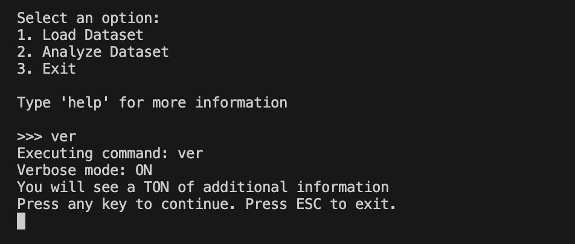

# cypro_pyproject
Final Project for Python Module of Data Analytics Course at CyberPro Israel
## Collaborators:
Ilia Oleinikov

Svetlana Saveleva

## Key Features:
- CLI-wrapped program for analyzing sales data
- Multi-functional nested CLI menu with mutable verbose mode
- Dataset backup
- Data loading and cleaning
- Cleaned data export
- Data visualization
- Export plots as PNGs
- ASCII art

## Project Goals:
- Create an user-friendly CLI-based program that allows sales data analysis, providing insights into market trends and patterns

## Project Description
The project contains several Python files that work in tandem to create the program. Each file can function separately to do its designated task:

### `cli.py`
The `cli.py` file provides a CLI-based user-friendly interface that encapsulates all of the program's functions.

It also contains a dictionary of commands that can be run from anywhere within the menus. This file is the main file of the program.

### `loading_cleaning.py`
The `loading_cleaning.py` file contains the functions that load, backup, clean and export cleaned data.

The main function of this file is `import_and_clean_data` that has the following parameters:
- `DATA_filepath`: The file path to the input data file.
- `verboseMode`: A boolean flag to enable or disable verbose mode, which controls the level of output and logging.
- `backup`: A boolean flag to enable or disable data backup, which creates a copy of the original data file.
- `fix_dtypes`: A boolean flag to enable or disable data type fixing, which attempts to correct data type errors in the input data.
- `del_miss_val`: A boolean flag to enable or disable deletion of missing values, which removes rows or columns with missing data.
- `fill_miss_val`: A boolean flag to enable or disable filling of missing values, which replaces missing data with a specified value.
- `rem_dupl`: A boolean flag to enable or disable removal of duplicates, which removes duplicate rows from the input data.
- `export_clean`: A boolean flag to enable or disable export of cleaned data, which saves the cleaned data to a new file.

### `analysis_plotting.py`
The `analysis_plotting.py` file contains useful KPI and plotting functions that can be used to analyze the dataset.

The KPI functions are as follows:
- `genres_by_top_publishers`

    → What it shows: The genres and games released by the top publishers in a given region.
    
    → Why: Helps identify market trends and popular genres among the most successful publishers.
    
    Find top n publishers by sales for a given year and show the number of games published by top publishers by genre for the same year

- `total_sales_over_time_in_region`

    → What it shows: The total volume of sales of all games in the region by months or years.
    
    → Why: It allows to understand the overall trends in 
    the market (downturns, peaks of interest in games).
    
    Grouping by year and summing up sales

- `franchise_sales_over_time`

    → What it shows: The volume of sales of one franchise broken down by months or years.
    
    → Why: Helps identify the performance of the given franchise in the market.
    
    Grouping by game and summing up sales

- `average_sales_per_genre_per_region`

    → What it shows: The average volume of sales of one game in each region (NA, EU, JP, Other).
    
    → Why: Helps identify regions with the highest engagement in buying games.
    
    Grouping by genre and region, calculating the average sales

Each of these functions has the following parameters (excluding those parameters needed for calculations):

-  `plot`: A boolean flag that controls whether to generate a plot or not.
-  `save_plot`: A boolean flag that controls whether to save the generated plot as a PNG file or not.
-  `show_plot`: A boolean flag that controls whether to display the generated plot or not.

### `graphics_messages.py` 
This file contains ASCII art, various menu messages, and is used by `cli.py`. It does not contain any functions.

### Tools & Technologies
- Python v.3.13.5

### Used External Libraries
- Pandas v.2.3.1
- NumPy v.2.3.1
- Matplotlib v.3.10.3

## Dataset Description
The dataset used in this project is a collection of sales data for PS4 games. The data is stored in a CSV file named PS4_GamesSales.csv and contains information about various games, including their sales figures in different regions.

Each row in the dataset represents a single game, and the columns provide the following information:

- `Game`: Game title
- `Year`: Release year
- `Genre`: Generalized Genre
- `Publisher`: Publishing company name
- `North America`, `Europe`, `Japan`, `Rest of World`: Sales figures in different regions (in millions of copies)
- `Global`: Contains the sum of sales in all of the regions (in millions of copies)

The dataset is used to analyze sales trends and patterns in the PS4 gaming market, and to gain insights into the performance of different games and publishers.

## How to use
To use the program, follow these steps:

1. Run the CLI: Execute the `cli.py` file to launch the command-line interface.

2. Navigate the Menu: Use the menu options to select the desired functionality, such as data loading, cleaning, analysis, and visualization.

3. Configure Options: Configure the options for each function as needed, such as enabling or disabling verbose mode, deleting missing values, filling missing values, removing duplicates, and exporting cleaned data.

4. Run Analysis and Visualization: Run the analysis and visualization functions to generate plots and insights into the PS4 game sales data.

5. Save and/or Display Plots: Use the save_plot and show_plot options to control whether to save the generated plots as PNG files and display them.

6. Explore and Repeat: Explore the results, adjust options as needed, and repeat the analysis and visualization process to gain deeper insights into the data.